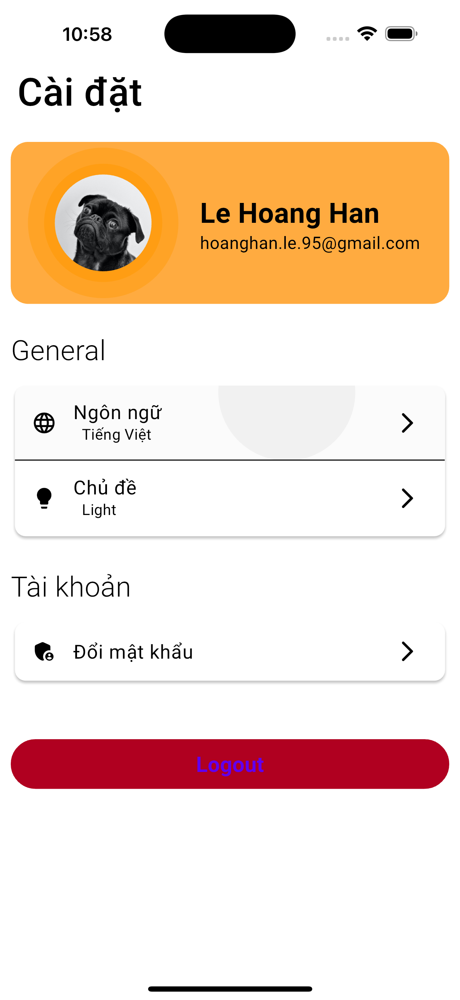
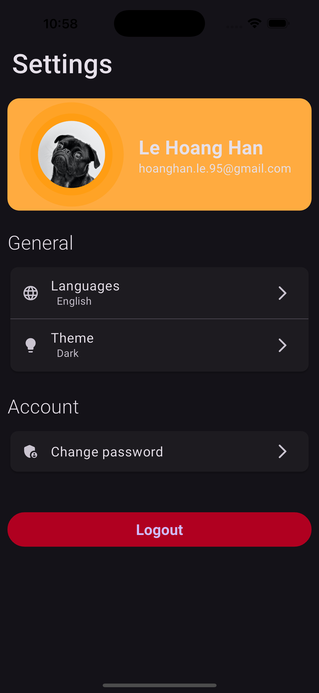

# 🚀 Base Flutter Project (With GetX)

( Tiếng Việt 🇻🇳 | English 🇬🇧 )  
Ứng dụng Flutter được xây dựng với GetX để quản lý trạng thái và hỗ trợ đa ngôn ngữ.   
The Flutter application built with GetX for state management and multilingual support.

## 📸 Demo

  

## 🔥 Features | Tính năng chính

✅ State management using GetX  
✅ Flavor  
✅ Multilingual support  
✅ Dark mode / Light mode  
✅ Splash screen

## 📂 Folder Structure | Cấu trúc thư mục

```
lib/
  |-app/                                ---> this is where all the application's directories will be contained
    |-core/                             ---> place app core
        |-languages/                    ---> for applications that use internationalization, they can deposit their translation files here
            |-en_us.dart                ---> define English translation file
            |-ja_jp.dart                ---> define Japanese translation file
            |-vi_vn.dart                ---> define Vietnamese translation file
        |-utils/                        ---> place app utils
            |-app_asset.dart            ---> define app assets
            |-app_config.dart           ---> define app config multi environment
            |-app_colors.dart           ---> define app colors
            |-app_enum.dart             ---> define app enum
            |-app_extension.dart        ---> define app extension
            |-app_helper.dart           ---> define app helper
            |-app_log.dart              ---> define app logger
            |-app_style.dart            ---> define app style
            |-app_themes.dart           ---> define app themes
    |-data/                             ---> place responsible for containing everything related to our data
        |-models/                       ---> place app data model
            |-token_model.dart          ---> define token response model
            |-user_model.dart           ---> define user response model
        |-providers/                    ---> place app provider
            |-base_provider.dart        ---> define base provider
    |-modules/                          ---> define all pages/screens of application
        |-home/                         ---> place app home modules included home ui and logic. We should organize as app module (eg: home, about, ...)
            |-bindings/                 ---> define home bindings
            |-controllers/              ---> define home logic
            |-views/                    ---> define home ui
            |-widgets/                  ---> define custom widget only for home module
    |-routes/                           ---> place app routes and pages
        |-app_pages.dart                ---> define routing
        |-app_routes.dart               ---> define constant routes
    |-services/                         ---> place app services
        |-app_binding.dart              ---> define init dependencies
        |-auth_service.dart             ---> define authorization service
        |-localization_service.dart     ---> define localization service
        |-notification_service.dart     ---> define notification service
    |-widgets/                          ---> place app widgets for all app
        |-p_appbar_transparency.dart    ---> define wrapper widget use for page, transparent status bar
        |-w_dismiss_keyboard.dart       ---> define component widget with auto dismiss keyboard when click on screen
  |-main.dart                           ---> application bootstrap

test/                              ---> place app unit, widget tests
test_driver/                       ---> place integration testing
```

## 📦 Technologies Used | Công nghệ sử dụng

- get (4.6.6) 👉 https://pub.dev/packages/get
- get_storage 👉 https://pub.dev/packages/get_storage
- flutter_screenutil (5.9.3) 👉 https://pub.dev/packages/flutter_screenutil
- flutter_native_splash 👉 https://pub.dev/packages/flutter_native_splash
- flutter_svg 👉 https://pub.dev/packages/flutter_svg
- logger 👉 https://pub.dev/packages/logger